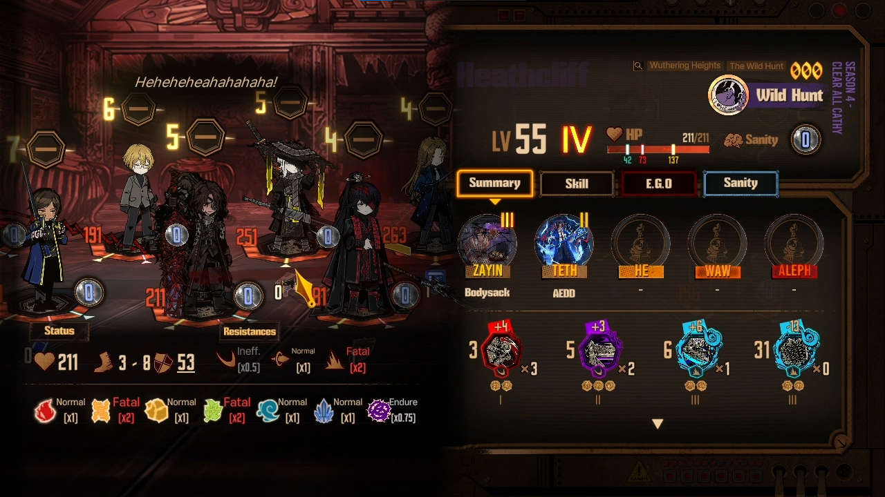
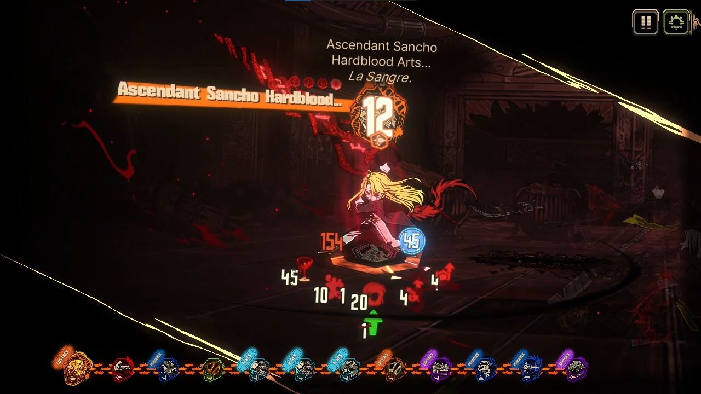
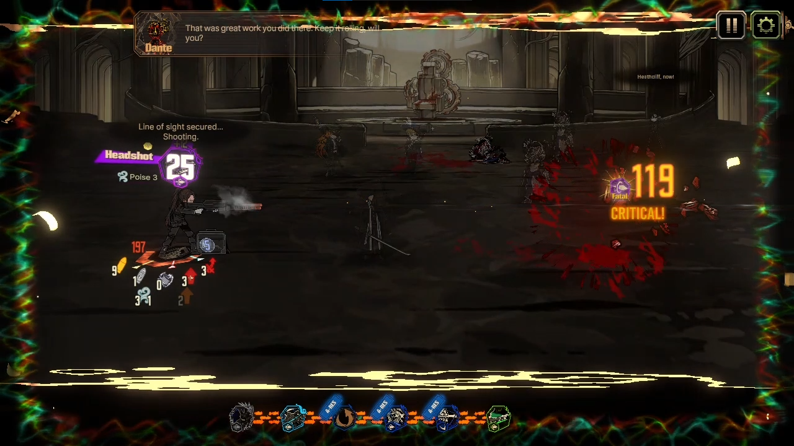
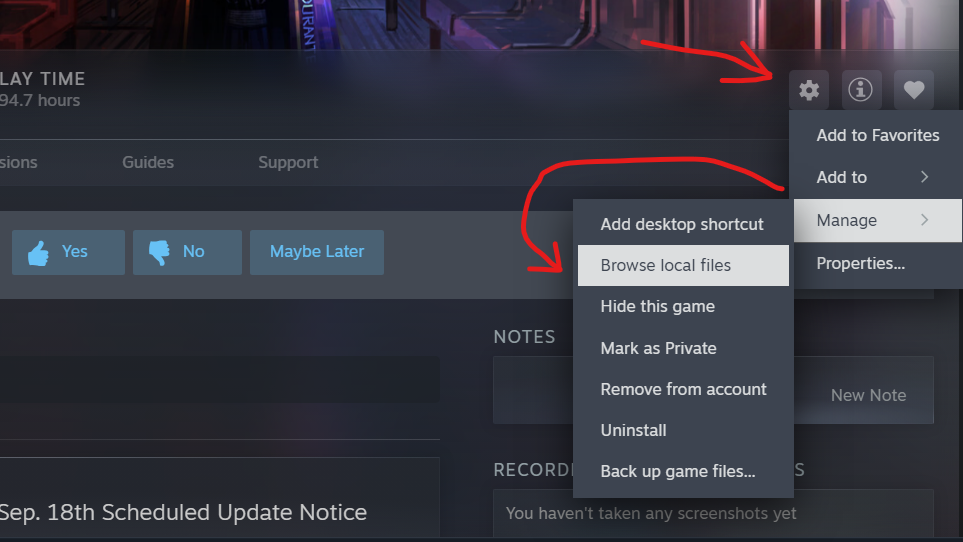
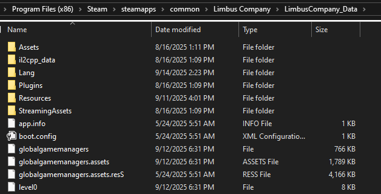
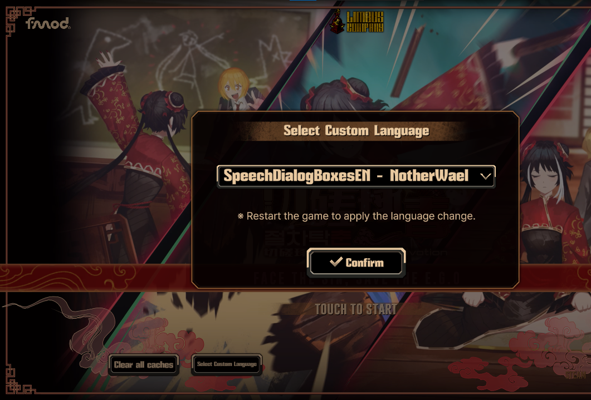

# Limbus Company Dialogue Boxes for Enemies & Identities!

This mod adds speech bubbles for all characters with battle voicelines!
(Including Untranslated Lines!)

# Do NOTE That The Untranslated Voicelines are Unofficial Can Be Wrong at times!

## Installation
### Whenever a new UPDATE happens, PLEASE DISABLE the mod!!! and wait for a new update on this repository. (or else you would face issues like [softlocking](https://www.youtube.com/watch?v=nHrCFfdBMAA))
### Honestly I recommend you to not use this mod at all when there is new story content, so finish and enjoy the new story first and then use the mod!
1. Click **Code** → **Download ZIP** on this GitHub repository.
2. Open or Extract the ZIP file.
3. Navigate to your Limbus Company folder, and open the 'LimbusCompany_Data' folder
Ex.`C:\Program Files (x86)\Steam\steamapps\common\Limbus Company\LimbusCompany_Data`
      
      

5. Drag the "Lang" folder from the ZIP file into the "LimbusCompany_Data" folder.
      

5. Launch the game, click on "Select Custom Language," choose **SpeechDialogBoxesEN - NotherWael**, and restart the game.  
   - If it’s already selected, you can skip this step.
   
6. Enjoy the mod!

- To update, Delete `SpeechDialogBoxesEN - NotherWael` in the `Lang` folder, and put in the new one.
  (This will remove your custom fonts, so add them back)
- To disable this mod, simply remove the Lang Folder and restart the game, or Select "-" in "Select Custom Langauge" at the start menu, and restart the game.
## Custom Font Styles Instructions
1. Click **Code** → **Download ZIP** on this GitHub repository.
2. Open or Extract the ZIP file.
3. Navigate to your Limbus Company folder, and open the 'LimbusCompany_Data' folder
4. Open the 'Lang' folder and then 'SpeechDialogBoxesEN - NotherWael' folder
5. Delete the 'Font' Folder
6. From the ZIP file, Open 'Custom Fonts' folder & Choose a Style.
7. Open the folder of the style you choose and copy the 'Font' folder
8. Paste the 'Font' folder in the 'SpeechDialogBoxesEN - NotherWael' folder
9. Done! & Restart the game if open.

## Q&A
1. Is this bannable?
   - No! it's not, it's a custom language mod supported by PM, It just changes the localization files.
   - PM stated "Please note that, modification of the game client beyond the language text files, such as modification of client images or in-game data could be met with legal action or bans without prior warning"
   - This Mod only modifies langauge text files, so it's safe. [Link For the Notice](https://store.steampowered.com/news/app/1973530/view/533220039674824558)

2. How is this done?
   - Using the file `BattleSpeechBubbleDlg.json` you can add your own speech bubble text! (just needs the Voiceline ID and the text.)

## Downsides & Issues
### This covers every battle voiceline in the game!!! So there might be a few characters missing lines if I've missed them, or if I've put the wrong voiceline ID, LMK if there are any!

- Some voicelines cannot display speech bubbles (e.g., Devyat's Polu or Full-stop Heathcliff in Overwatch state).  
- Font may not match the base game... (like Mikodacs Font, not having Letter Spacing from the base game.) but you can use your own custom fonts!  
- A green icon appears in the top-right corner during battle or story, indicates you are using a custom language mod.  
- Game start-up screen menu loading may take ages! (though it might be cause of my weak device... so i'm not sure) 
- Speech bubbles stay longer than they have to blocking visibility on skills during combat.
- Speech bubbles can end early because of the previous speech bubble before it.
- Retreating IDs VLs move their Speech bubbles to the Substituted ID.

## Known Voicelines That Do Not Work
- Devyat North Sinclair & Rodion All Poludnitsa Lines (Except the death ones cause i can fit it in with their death lines.)
- Overwatch Assignment Full-stop Heathcliff Combo Voicelines (He's not in battle, i could try to put it with FS Hong Lu's line, but his line has two variants so... i guess i'll put both!)
- N Corp Ryoshu and Yi Sang Skill Combo I Shall Fire // Anytime (Yeah the speech bubble just doesn't want to appear above her head at all, and yes i did check if it's the correct ID.)
- Bloodfiend Trio Stage Turn Start VLs Don't Work Except for The Priest. (Their Skill VLs work tho... and some of these turn start voicelines do work on their respective stages.)

## Credits
Goliath for telling me how to do this, they make a Russian translation custom langauge mod.
https://github.com/Divine-Company/DivineCompany_RussianTranslationDepartment
